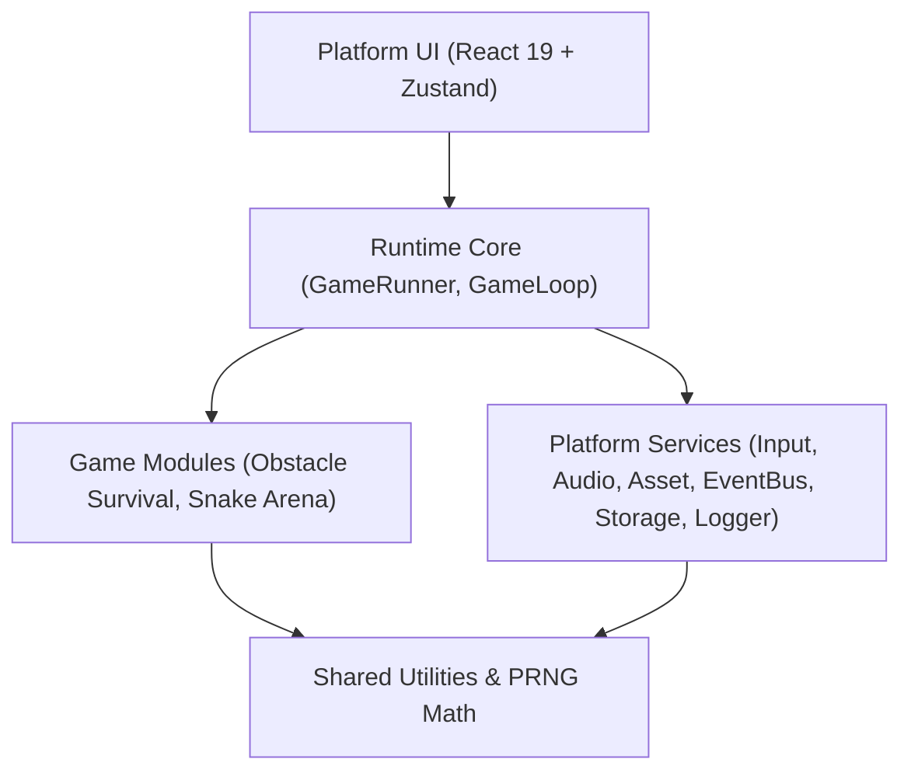

# PartyPlay Architecture Guide

PartyPlay is built as a **Modular Monolith** designed specifically as a browser-based local multiplayer game console. The architecture prioritizes adding the 10th game over short-term convenience for the 1st game.

---

## 1. System Layers & Boundary Enforcements

The codebase is organized into five strict layers with unidirectional dependency flow enforced at compile-time by `eslint-plugin-boundaries`.



### Layer Responsibilities

| Layer | Path | Responsibilities | Allowed Imports |
|-------|------|------------------|-----------------|
| **Platform** | `src/platform/` | React UI screens (`MainMenu`, `GameBrowser`, `PlayerSetup`, `GamePlay`, `GameResults`, `Settings`, `CrashScreen`), Zustand stores (`platformStore`, `settingsStore`), pixel theme CSS. | `Runtime`, `Services`, `Shared`, React, Zustand |
| **Runtime** | `src/runtime/` | Host engine environment: canvas initialization, fixed 60 FPS ticker loop, PixiJS renderer wrapping, crash safety boundary, game module instantiation. | `Services`, `Shared`, PixiJS |
| **Services** | `src/services/` | Independent cross-cutting services: `InputService`, `AudioService`, `StorageService`, `EventService`, `AssetService`, `LoggerService`. | `Shared`, Web APIs (Web Audio, LocalStorage, Gamepad) |
| **Shared** | `src/shared/` | Pure math utilities, vector helpers, mulberry32 PRNG generator, common types. | Standard JS/TS built-ins only |
| **Games** | `src/games/` | Self-contained micro-game packages (`manifest.ts`, `index.ts`, entities, systems). | `Services`, `Shared`, Runtime Types. **NEVER `pixi.js` directly!** |

---

## 2. PixiJS 2D Renderer Abstraction

Games never import `pixi.js` directly. All rendering interaction occurs through the `RendererContext` interface injected via `GameContext`.

```typescript
// src/runtime/types.ts
export interface RendererContext {
  readonly canvas: HTMLCanvasElement;
  readonly stage: Container;
  readonly viewport: { width: number; height: number };
  readonly ticker: Ticker;
  resize(): void;
}
```

### Implementation (`PixiRendererContext`)
- **Virtual Dimensions**: Fixed **480 × 270** native resolution.
- **Integer Scaler**: Computes integer multiplier (`1x`, `2x`, `3x`, `4x`) based on container bounds:
  $$\text{integerScale} = \max\left(1, \min\left(\lfloor \frac{\text{window.innerWidth}}{480} \rfloor, \lfloor \frac{\text{window.innerHeight}}{270} \rfloor\right)\right)$$
- **Pixelated Canvas Styling**: `image-rendering: pixelated; image-rendering: crisp-edges;`.
- **Nearest-Neighbor Sampling**: `TextureSource.defaultOptions.scaleMode = 'nearest'`.

---

## 3. Pure Dependency Injection (`GameContext`)

When a game is launched, the `GameRunner` constructs a fresh `GameContext` instance and passes it to `GameModule.init(context)`:

```typescript
export interface GameContext {
  renderer: RendererContext;
  input: InputService;
  audio: AudioService;
  storage: StorageService; // Namespaced to "games:<game-id>"
  events: EventService;
  random: PRNG;
  asset: AssetService;
  logger: LoggerService;
  modifiers: GameModifiers;
  players: PlayerConfig[];
}
```

### Benefits
1. **Zero Global Singletons**: Games cannot mutate shared platform state.
2. **Instant Reset**: Destroying a game and restarting creates a clean isolated state.
3. **Deterministic Testing**: `random` is a seeded PRNG (`createPRNG(seed)`), enabling reproducible match replays.

---

## 4. Dynamic Auto-Discovery Registry

Games are discovered automatically at build time using Vite's `import.meta.glob`:

```typescript
// src/runtime/GameRegistry.ts
class GameRegistryService {
  private entries = new Map<string, GameRegistryEntry>();

  constructor() {
    // Eager import all manifests for instant UI listing
    const manifests = import.meta.glob<{ default: GameManifest }>('../games/*/manifest.ts', { eager: true });
    
    // Lazy import index.ts chunks for dynamic code-splitting
    const gameModules = import.meta.glob<{ default: new () => GameModule }>('../games/*/index.ts');

    for (const [path, mod] of Object.entries(manifests)) {
      const dir = path.split('/')[2];
      const indexKey = `../games/${dir}/index.ts`;
      if (gameModules[indexKey]) {
        this.entries.set(mod.default.id, {
          manifest: mod.default,
          load: gameModules[indexKey],
        });
      }
    }
  }
}
```

To add a 3rd game: Create `src/games/my-new-game/` containing `manifest.ts` and `index.ts`. No configuration files or registry lists need to be touched!

---

## 5. Crash Safety Boundary & Async Protection

### Async `launchId` Token Pattern
When launching async setup routines (asset loading, canvas init), user fast-clicking could trigger consecutive launch/destroy calls. `GameRunner` prevents race conditions with an incrementing token:

```typescript
public async launchGame(...): Promise<void> {
  await this.stopGame();
  const currentLaunchId = ++this.launchId;

  // Step 1: Canvas init
  await this.pixiApp.init(...);
  if (currentLaunchId !== this.launchId) {
    this.pixiApp.destroy(true);
    return; // Cancelled by newer launch!
  }

  // Step 2: Async game load
  const { default: GameClass } = await entry.load();
  if (currentLaunchId !== this.launchId) return;

  // Step 3: Game init
  await this.currentGame.init(context);
  if (currentLaunchId !== this.launchId) return;

  // Start loop
  this.gameLoop.start(this.currentGame, (err) => this.handleCrash(err));
}
```

### Unhandled Exception Isolation
If a game module throws an exception during `update()` or `render()`, `GameLoop` catches the error, halts the ticker, safely tears down PixiJS, and emits `game:crash`. The Platform UI cleanly transitions to `<CrashScreen />` displaying the stack trace without crashing the browser console shell.

---

## 6. Deterministic Fixed 60 FPS Game Loop

```typescript
// src/runtime/GameLoop.ts
const FIXED_DT = 1 / 60; // 16.67ms
const MAX_STEPS = 5;

private frame(ticker: Ticker): void {
  this.accumulator += ticker.deltaMS / 1000;
  let steps = 0;

  while (this.accumulator >= FIXED_DT && steps < MAX_STEPS) {
    this.inputService.tick();
    this.game.update(FIXED_DT);
    this.accumulator -= FIXED_DT;
    steps++;
  }
}
```

- Logic steps run at a strict `1/60s` step size.
- Clamped at `MAX_STEPS = 5` to prevent the spiral-of-death on slow devices.
